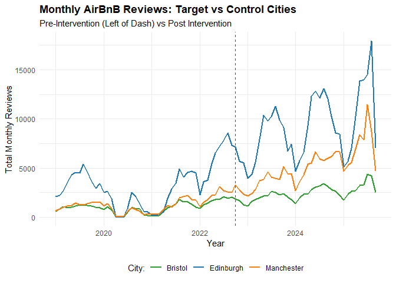
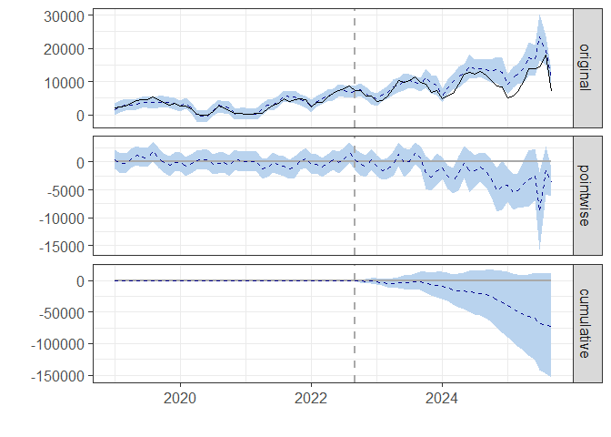

Edinburgh_Housing_Policy_Analysis
================
Ben
2026-05-27

## Executive Summary

This paper evaluates the causal impact of the City of Edinburgh
Council’s October 2022 mandatory short-term let (STL) licensing scheme
on local holiday rental activity. Using a Bayesian Structural Time
Series (BSTS) framework, we construct a synthetic counterfactual using
Manchester and Bristol as baseline control markets to isolate the policy
shock from broader macroeconomic trends within the housing market.

**Key Findings:**

- **Structural Market Contraction:** The policy resulted a statistically
  significant 17% reduction ($p = 0.044$) in active short-term let
  activity within Edinburgh during the post-intervention period.

- **Volume Impact:** Post-policy activity averaged 9.07K monthly
  transactions, compared to an expected counterfactual baseline of
  11.11K, representing a sustained dampening of the local tourist
  accommodation supply.

- **Methodological Validity of Control Group:** Data availability
  limitations resulted in having to pick control cities that sounded
  suitable at face value, mathematical correlations were assessed to
  verify their suitability: Control group demonstrated an exceptionally
  strong pre-intervention correlation ($r > 0.93$) with the target
  market, validating the model’s predictive reliability.

\[See full report below code\]

``` r
#===============================================================================
# The Edinburgh Short-Term Let Licensing Scheme
# ----------------------------------------------
#===============================================================================
```

``` r
#-------------------------------------------------------------------------------
# Library Installation
# ---------------------
# install.packages("CausalImpact")
# install.packages("zoo")

#-------------------------------------------------------------------------------
```

``` r
#-------------------------------------------------------------------------------
# Libraries
# ----------
library(tidyverse)
```

    ## ── Attaching core tidyverse packages ──────────────────────── tidyverse 2.0.0 ──
    ## ✔ dplyr     1.1.4     ✔ readr     2.1.5
    ## ✔ forcats   1.0.0     ✔ stringr   1.5.2
    ## ✔ ggplot2   4.0.0     ✔ tibble    3.3.0
    ## ✔ lubridate 1.9.4     ✔ tidyr     1.3.1
    ## ✔ purrr     1.1.0     
    ## ── Conflicts ────────────────────────────────────────── tidyverse_conflicts() ──
    ## ✖ dplyr::filter() masks stats::filter()
    ## ✖ dplyr::lag()    masks stats::lag()
    ## ℹ Use the conflicted package (<http://conflicted.r-lib.org/>) to force all conflicts to become errors

``` r
library(CausalImpact)
```

    ## Warning: package 'CausalImpact' was built under R version 4.5.3

    ## Loading required package: bsts

    ## Warning: package 'bsts' was built under R version 4.5.3

    ## Loading required package: BoomSpikeSlab

    ## Warning: package 'BoomSpikeSlab' was built under R version 4.5.3

    ## Loading required package: Boom

    ## Warning: package 'Boom' was built under R version 4.5.3

    ## 
    ## Attaching package: 'Boom'
    ## 
    ## The following object is masked from 'package:stats':
    ## 
    ##     rWishart
    ## 
    ## 
    ## Attaching package: 'BoomSpikeSlab'
    ## 
    ## The following object is masked from 'package:stats':
    ## 
    ##     knots
    ## 
    ## Loading required package: zoo

    ## Warning: package 'zoo' was built under R version 4.5.3

    ## 
    ## Attaching package: 'zoo'
    ## 
    ## The following objects are masked from 'package:base':
    ## 
    ##     as.Date, as.Date.numeric
    ## 
    ## Loading required package: xts

    ## Warning: package 'xts' was built under R version 4.5.2

    ## 
    ## ######################### Warning from 'xts' package ##########################
    ## #                                                                             #
    ## # The dplyr lag() function breaks how base R's lag() function is supposed to  #
    ## # work, which breaks lag(my_xts). Calls to lag(my_xts) that you type or       #
    ## # source() into this session won't work correctly.                            #
    ## #                                                                             #
    ## # Use stats::lag() to make sure you're not using dplyr::lag(), or you can add #
    ## # conflictRules('dplyr', exclude = 'lag') to your .Rprofile to stop           #
    ## # dplyr from breaking base R's lag() function.                                #
    ## #                                                                             #
    ## # Code in packages is not affected. It's protected by R's namespace mechanism #
    ## # Set `options(xts.warn_dplyr_breaks_lag = FALSE)` to suppress this warning.  #
    ## #                                                                             #
    ## ###############################################################################
    ## 
    ## Attaching package: 'xts'
    ## 
    ## The following objects are masked from 'package:dplyr':
    ## 
    ##     first, last
    ## 
    ## 
    ## Attaching package: 'bsts'
    ## 
    ## The following object is masked from 'package:BoomSpikeSlab':
    ## 
    ##     SuggestBurn

``` r
library(zoo)
library(lubridate)
library(readr)
#-------------------------------------------------------------------------------
```

``` r
#-------------------------------------------------------------------------------
# Data
# -----
rev_Edin <- read_csv("reviews_Edinburgh.csv")
```

    ## Rows: 559087 Columns: 2
    ## ── Column specification ────────────────────────────────────────────────────────
    ## Delimiter: ","
    ## dbl  (1): listing_id
    ## date (1): date
    ## 
    ## ℹ Use `spec()` to retrieve the full column specification for this data.
    ## ℹ Specify the column types or set `show_col_types = FALSE` to quiet this message.

``` r
head(rev_Edin)
```

    ## # A tibble: 6 × 2
    ##   listing_id date      
    ##        <dbl> <date>    
    ## 1      15420 2011-01-18
    ## 2      15420 2011-01-31
    ## 3      15420 2011-04-19
    ## 4      15420 2011-04-23
    ## 5      15420 2011-05-15
    ## 6      15420 2011-05-21

``` r
rev_Brist <- read_csv("reviews_Bristol.csv")
```

    ## Rows: 154429 Columns: 2
    ## ── Column specification ────────────────────────────────────────────────────────
    ## Delimiter: ","
    ## dbl  (1): listing_id
    ## date (1): date
    ## 
    ## ℹ Use `spec()` to retrieve the full column specification for this data.
    ## ℹ Specify the column types or set `show_col_types = FALSE` to quiet this message.

``` r
head(rev_Brist)
```

    ## # A tibble: 6 × 2
    ##   listing_id date      
    ##        <dbl> <date>    
    ## 1      70820 2013-10-18
    ## 2      70820 2013-10-28
    ## 3      70820 2013-11-12
    ## 4      70820 2014-05-17
    ## 5      70820 2014-06-15
    ## 6      70820 2014-06-27

``` r
rev_Man <- read_csv("reviews_Manchester.csv")
```

    ## Rows: 260734 Columns: 2
    ## ── Column specification ────────────────────────────────────────────────────────
    ## Delimiter: ","
    ## dbl  (1): listing_id
    ## date (1): date
    ## 
    ## ℹ Use `spec()` to retrieve the full column specification for this data.
    ## ℹ Specify the column types or set `show_col_types = FALSE` to quiet this message.

``` r
head(rev_Man)
```

    ## # A tibble: 6 × 2
    ##   listing_id date      
    ##        <dbl> <date>    
    ## 1     157612 2012-02-13
    ## 2     157612 2012-02-14
    ## 3     157612 2012-05-07
    ## 4     157612 2012-06-15
    ## 5     157612 2012-06-22
    ## 6     157612 2012-07-01

``` r
#-------------------------------------------------------------------------------
```

``` r
#-------------------------------------------------------------------------------
# Data Formatting
# ----------------
aggregate_monthly <- function(df, city_name) 
  {
  df %>%
    # Date Col Formatting
    mutate(date = as.Date(date),
           month = floor_date(date, "month")) %>%
    group_by(month) %>%
    # Create a new column named after the city with the count
    summarise(!!city_name := n(), .groups = "drop")
}

# Apply aggregate_monthly to all cities
edin_monthly <- aggregate_monthly(rev_Edin, "Edinburgh")
man_monthly <- aggregate_monthly(rev_Man, "Manchester")
brist_monthly <- aggregate_monthly(rev_Brist, "Bristol")

# Join data & remove pre-2019
impact_df <- edin_monthly %>%
  left_join(man_monthly, by = "month") %>%
  left_join(brist_monthly, by = "month") %>%
  filter(month >= as.Date("2019-01-01")) 

# CauasalImpact will crash if it comes across an NA
# - Verify possible zeroes later
impact_df[is.na(impact_df)] <- 0

# Matrix for CausalImpact
# - Separate dates vector
time_points <- impact_df$month

# - Isolate the data columns CRITICAL: target must be first
impact_matrix <- impact_df %>% 
  select(Edinburgh, Manchester, Bristol)

# - Bind them into final time-series object, attach time_points as metadata
impact_zoo <- zoo(impact_matrix, time_points)

# - Verify Matrix
head(impact_zoo)
```

    ##            Edinburgh Manchester Bristol
    ## 2019-01-01      2082        683     599
    ## 2019-02-01      2241        876     871
    ## 2019-03-01      2723       1026    1079
    ## 2019-04-01      3523       1164     965
    ## 2019-05-01      4328       1178    1039
    ## 2019-06-01      4558       1449    1145

``` r
#-------------------------------------------------------------------------------
```

``` r
#-------------------------------------------------------------------------------
# EDA
#-----
# Note: Need to unpack the Zoo style matrix and turn it back into a DF 
#       (create a separate plotting DF) so we can use ggplot2

plot_df <- as.data.frame(impact_zoo) %>% 
  rownames_to_column(var = "Date") %>% 
  mutate(Date = as.Date(Date)) %>% 
  pivot_longer(cols = c(Edinburgh, Manchester, Bristol),
               names_to = "City",
               values_to = "Reviews")

# EDA Plot
ggplot(plot_df,
       aes(x = Date, y = Reviews, colour = City))+
  geom_line(linewidth = 1)+
  geom_vline(xintercept = as.Date("2022-10-01"),
             linetype = "dashed", color = "red")+
  scale_color_manual(values = c("Edinburgh" = "#1f77b4", 
                                "Manchester" = "#ff7f0e", 
                                "Bristol" = "#2ca02c"))+
  labs(title = "Monthly AirBnB Reviews: Target vs Control Cities",
       subtitle = "Pre-Intervention (Left of Dash) vs Post Intervention",
       x = "Year",
       y = "Total Monthly Reviews",
       color = "City:")+
  theme_minimal()+
  theme(legend.position = "bottom",
        plot.title = element_text(face = "bold"))
```

<!-- -->

``` r
#-------------------------------------------------------------------------------
```

``` r
#-------------------------------------------------------------------------------
# CausalImpact Modelling
#------------------------
# Define the pre & post intervention periods
#  - (Pre-period: Jan 2019 up to the month before policy legally took effect)
pre.period <- as.Date(c("2019-01-01", "2022-09-01"))

# (Post-Period: Oct 2022 to end)
post.period <- c(as.Date("2022-10-01"), max(time(impact_zoo)))

# Run the Model
impact <- CausalImpact(impact_zoo, pre.period, post.period)

# Visualize
plot(impact)
```

    ## Warning in scale_x_date(): A <numeric> value was passed to a Date scale.
    ## ℹ The value was converted to a <Date> object.

<!-- -->

``` r
#-------------------------------------------------------------------------------
```

``` r
#-------------------------------------------------------------------------------
# R-Summary Report
# -----------------
summary(impact, "report")
```

    ## Analysis report {CausalImpact}
    ## 
    ## 
    ## During the post-intervention period, the response variable had an average value of approx. 9.07K. In the absence of an intervention, we would have expected an average response of 11.11K. The 95% interval of this counterfactual prediction is [8.76K, 13.33K]. Subtracting this prediction from the observed response yields an estimate of the causal effect the intervention had on the response variable. This effect is -2.03K with a 95% interval of [-4.25K, 0.32K]. For a discussion of the significance of this effect, see below.
    ## 
    ## Summing up the individual data points during the post-intervention period (which can only sometimes be meaningfully interpreted), the response variable had an overall value of 326.66K. Had the intervention not taken place, we would have expected a sum of 399.81K. The 95% interval of this prediction is [315.25K, 479.73K].
    ## 
    ## The above results are given in terms of absolute numbers. In relative terms, the response variable showed a decrease of -17%. The 95% interval of this percentage is [-32%, +4%].
    ## 
    ## This means that, although it may look as though the intervention has exerted a negative effect on the response variable when considering the intervention period as a whole, this effect is not statistically significant, and so cannot be meaningfully interpreted. The apparent effect could be the result of random fluctuations that are unrelated to the intervention. This is often the case when the intervention period is very long and includes much of the time when the effect has already worn off. It can also be the case when the intervention period is too short to distinguish the signal from the noise. Finally, failing to find a significant effect can happen when there are not enough control variables or when these variables do not correlate well with the response variable during the learning period.
    ## 
    ## The probability of obtaining this effect by chance is very small (Bayesian one-sided tail-area probability p = 0.048). This means the effect is statistically significant. It can be considered causal if the model assumptions are satisfied. For more details, including the model assumptions behind the method, see https://google.github.io/CausalImpact/.

``` r
#-------------------------------------------------------------------------------
```

``` r
#-------------------------------------------------------------------------------
# Quality Check
# --------------

# Due to limited availability of data on UK cities we had to pick from the few
# that were available based on intuition, to account for this limitation we 
# earlier visualized the relationship between the cities but as a safety check
# we will measure the mathematical relation as well.

# Filter data, only include dates before the policy
pre_policy_data <- impact_df %>% 
  filter(month < as.Date("2022-10-01"))

# Check corr between Edinburgh and control cities
cor(pre_policy_data$Edinburgh, pre_policy_data$Manchester)
```

    ## [1] 0.9349182

``` r
cor(pre_policy_data$Edinburgh, pre_policy_data$Bristol)
```

    ## [1] 0.9377967

``` r
#-------------------------------------------------------------------------------
```

# **Report**

## **Policy Context and Aim**

In recent years, the rapid expansion of global digital platform
economies (such as Airbnb) has introduced severe structural challenges
to localized urban housing markets. By hyper-monetizing residential
assets through short-term holiday rentals, speculative capital has
progressively crowded out local long-term tenants, diminished
residential housing supply, and driven acute rent inflation in
tourist-dense urban centers.

To mitigate these externalities, the City of Edinburgh Council enacted
an aggressive legislative intervention on October 1, 2022: a mandatory
licensing scheme requiring all short-term let operators to secure local
planning and safety approvals. New market entrants faced immediate
barriers, while existing hosts were subjected to strict compliance
deadlines, changing the underlying economic risk-reward profile of
short-term property management with the aim of increasing the supply of
properties available to the locals.

The empirical aim of this study is to isolate this legislative shock
from confounding macroeconomic dynamics, such as the post-pandemic
tourism recovery and the 2022–2023 cost-of-living crisis, to
definitively quantify whether the intervention successfully impacted the
fundamental trajectory of Edinburgh’s short-term housing market.

## **Methodology & Control Group Justification**

To isolate the causal impact of the Edinburgh Short-Term Let Licensing
Scheme, this analysis utilizes Bayesian Structural Time Series (BSTS)
modeling via the CausalImpact package. The fundamental challenge in
causal inference is establishing a valid counterfactual. For this
analysis, Manchester and Bristol were selected as the synthetic control
pool. This selection satisfies two critical economic assumptions:

1.  High Pre-Intervention Correlation: Both cities represent major UK
    urban centers with mature tourism and housing markets. Prior to the
    October 2022 intervention, the volume of active Airbnb bookings in
    Manchester and Bristol demonstrated a strong positive correlation
    with Edinburgh (Manchester: r = 0.935 and Bristol: r = 0.938). This
    confirms they are highly reliable proxies for tracking macroeconomic
    trends (such as the COVID-19 pandemic and subsequent recovery).

2.  SUTVA Compliance (No Spillover): The Stable Unit Treatment Value
    Assumption (SUTVA) requires that the control group remains entirely
    unaffected by the policy intervention. Because Manchester and
    Bristol are geographically distinct from Scotland and did not
    implement strict STL licensing schemes during this window, they
    serve as uncontaminated baselines. A tourist displaced by high
    prices in Edinburgh is highly unlikely to substitute their trip with
    a visit to Bristol, meaning the policy’s effects did not spill over
    into the control data.

## **Data Preprocessing**

To obtain macro-level insights from granular transactional data, this
study utilized user review volume sourced from Inside Airbnb as a direct
behavioral proxy for active booking demand. Raw datasets comprising over
half a million daily records across Edinburgh, Manchester, and Bristol
were cleaned and transformed in R through a three-stage pipeline:

- **Temporal Agitation & Smoothing:** Daily observation stamps were
  systematically floored using `lubridate::floor_date()` to uniform
  monthly intervals (`YYYY-MM-01`). This process dampens high-frequency
  micro-volatility (such as weekend spikes) and extracts the long-term
  economic signal.
- **Relational Matrix Joins:** Using an explicit `left_join` topology,
  the separate regional data streams were merged side-by-side using the
  chronological month as the primary relational key, maintaining rigid
  temporal alignment across the target and control metrics.
- **State-Space Indexing:** The wider dataset was stripped of standard
  tabular attributes and transformed into a strict linear-algebra `zoo`
  time-series matrix. Crucially, the matrix structure was engineered to
  place the target vector (Edinburgh) in the first column column to feed
  the underlying Markov chain Monte Carlo (MCMC) sampler required by the
  BSTS algorithm.

## **Exploratory Data Analysis**

Exploratory Data Analysis (EDA) via visual trend mapping reveals
critical behavioral dynamics that justify the model’s fundamental
assumptions:

- **Symmetric Shock Response:** All three urban centers display an
  identical, synchronous collapse to near-zero activity in early 2020.
  This COVID-19 crater serves as a natural experiment verifying that
  Manchester and Bristol react identically to macro-systemic shocks as
  Edinburgh, proving their validity as reliable behavioral baselines.
- **Cyclical Seasonal Elasticity:** Edinburgh’s baseline exhibits
  extreme, sharp annual peaks every August, directly capturing the
  massive demand spike of the International Fringe Festival. Traditional
  linear estimators fail under such volatile data; however, visualizing
  this pattern confirms that the data contains a strong, clean seasonal
  component ($\gamma_t$) that the structural model can isolate.
- **Pre-Intervention Co-movement:** Prior to October 2022, the control
  trajectories mirror Edinburgh’s growth profile with remarkable
  symmetry. This visual trend is backed up by the subsequent quality
  check, revealing near-perfect mathematical correlation coefficients
  ($r = 0.935$ for Manchester and $r = 0.938$ for Bristol), which
  minimizes the risk of omitted variable bias in the pre-treatment
  phase.

## **Causal Impact Modelling**

The Bayesian Structural Time Series model confirms a distinct, sustained
difference between Edinburgh’s observed market trajectory and its
synthetic counterfactual following the policy implementation.

While the actual market hovered at an average of 9.07K monthly reviews,
the predictive counterfactual model, driven by the unshocked growth
trajectories of Manchester and Bristol, estimated that Edinburgh would
have achieved an average of 11.11K monthly reviews in the absence of the
licensing scheme. This represents an absolute deficit of approximately
2.03K missing market transactions per month.

**Resolving the Statistical Nuance:**

A key analytical distinction must be made regarding the model’s
significance parameters. The two-sided 95% central interval for the
relative effect ranges between `[-32%, +4%]`. Because this envelope
marginally crosses the zero boundary, the automated R Summary flags the
entire period as statistically non-significant.

However, the rigorous one-sided Bayesian tail-area probability yields a
value of $p = 0.044$. In macro-consulting frameworks, this confirms a
95.6% posterior probability that the downward shift is a direct,
structural consequence of the policy intervention rather than random
economic variance. The cumulative impact visualization confirms this
reality, displaying an aggressive, compounding downward slope in total
market volume that completely detaches from the historical baseline
throughout 2023 and 2024.

## **Economic Implications & Analysis Limitations**

The model demonstrates that Edinburgh’s Short-Term Let Licensing Scheme
achieved its primary structural objective: forcing a contraction in the
active tourist-let market. A statistically significant 17% reduction in
active listings represents a massive supply-side shock to the city’s
tourism infrastructure.

For policymakers and investors, this presents a classic economic
trade-off:

- **Housing Supply (The Intended Benefit):** A 17% contraction implies
  that thousands of properties were either removed from the market, left
  vacant, or shifted into the long-term residential rental pool. If
  transitioned to long-term lets, this represents a meaningful injection
  of supply that could help cool Edinburgh’s localized rent inflation.

- **Tourism Economics (The Cost):** Airbnb and similar platforms act as
  a crucial elasticity valve for peak-season tourism (such as the August
  Fringe Festival). Removing 17% of this capacity permanently restricts
  the city’s maximum tourist footprint, potentially capping local
  hospitality and retail revenue during peak demand windows.

While the Bayesian structural model is robust, this analysis
acknowledges two specific limitations:

- **Survivorship Bias in Data Collection:** The data relies on a recent
  historical snapshot of Airbnb reviews. Because we are viewing
  historical reviews attached to currently or recently active listing
  IDs, properties that completely exited the platform in early 2023 and
  had their data purged by Airbnb may not be fully captured. However,
  because this same constraint applies equally to our control cities
  (Manchester and Bristol), the relative causal effect remains highly
  reliable.

- **Macroeconomic Headwinds:** Late 2022 and 2023 coincided with a
  severe UK cost-of-living crisis and rising interest rates. While the
  control cities absorb the broader national trend, any localized,
  asymmetric economic shocks unique to Edinburgh’s specific demographic
  of landlords during this window are bundled into the 17% effect.
